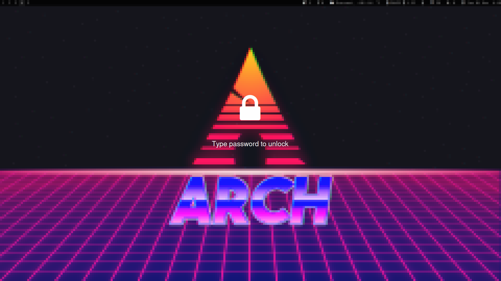

slock - simple screen locker (fork)
===================================
A bloated fork of suckless [slock](https://tools.suckless.org/slock) with lots of customizations.

This fork merges the following patches: 
- [slock-alternate-colors](https://tools.suckless.org/slock/patches/alternate-colors/): alternate colors on keyboard input
- [slock-blur_pixelated_screen](https://tools.suckless.org/slock/patches/blur-pixelated-screen/): blurs and pixelate the screen
- [slock-capscolor](https://tools.suckless.org/slock/patches/capscolor/): alternate color when caplock is on
- [slock-control-clear](https://tools.suckless.org/slock/patches/control-clear/): ignore control keys when buffer is empty
- [slock-dpms](https://tools.suckless.org/slock/patches/dpms/): turns off monitor after timeout
- [slock-dwmlogoandblurscreen](https://tools.suckless.org/slock/patches/dwmlogoandblurscreen/): adds a dwm logo
- [slock-failure-command](https://tools.suckless.org/slock/patches/failure-command/): exec command after X unsucessful attempts
- [slock-mediakeys](https://tools.suckless.org/slock/patches/mediakeys/): allows media keys to be used while screen is locked
- [slock-message-xft](https://github.com/nathanielevan/slock/blob/master/slock-message-xft-20210315-ae681c5.patch): shows a message, using xft fonts
- [slock-pam_auth](https://tools.suckless.org/slock/patches/pam_auth/): uses PAM auth
- [slock-quickcancel](https://tools.suckless.org/slock/patches/quickcancel/): cancel slock within small time period

And adds the following other changes:
- **lock icon** instead of the dwm logo (configurable)
- **quick cancel** using any keyboard key
- **configuration file**; using libconfig to loads configuration from `$XDG_CONFIG_HOME/slock/slock.cfg` if it exists

Building and installing
-----------------------

1. clone this repository locally on your machine
2. Install libconfig from your package manager
3. run `make clean && sudo make install` from within the repository folder
4. copy and edit the config file: `cp /etc/slock/slock.cfg $XDG_CONFIG_HOME/slock/slock.cfg`

Previews
--------

